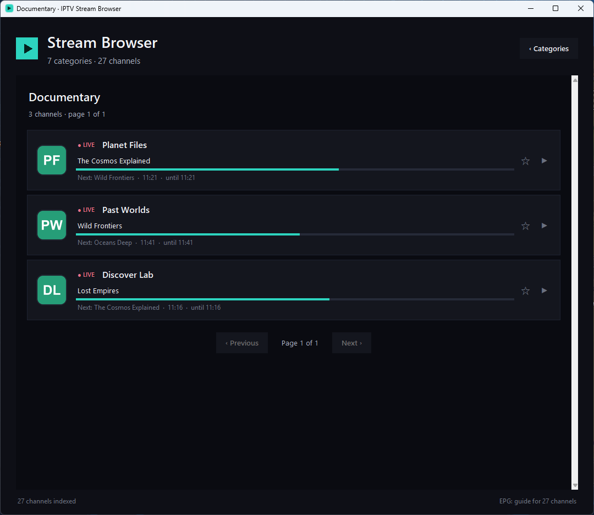
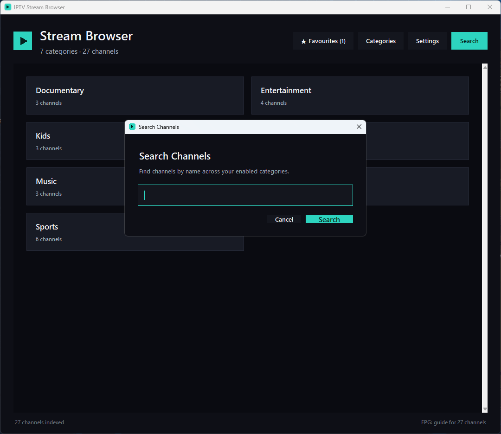
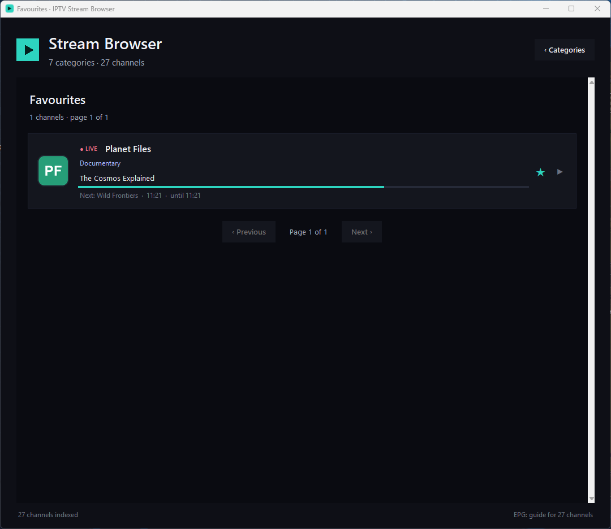

# OPEN-IPTV

[](https://github.com/Jordan-Hn/OPEN-IPTV/actions/workflows/ci.yml)


A fast, modern desktop browser for IPTV. Browse your categories, search, star
favourites, see what's **on now** for live channels, and play streams in VLC. It
stays smooth whether your playlist has a few hundred channels or hundreds of
thousands.

Bring your own IPTV source: an Xtream Codes login, or any M3U playlist. OPEN-IPTV
is a player and browser, not a provider. It ships with no channels and no
credentials.

## Screenshots


Browsing a category shows each live channel's current programme, a progress bar,
and what's on next:



| Search | Favourites | Set up any source |
| --- | --- | --- |
|  |  |  |

_Screenshots use generated demo data, not a real provider._

## Features

- **Huge playlists, instant UI.** Channels are indexed once and browsed lazily, so
  even very large playlists open without lag.
- **Live "now playing".** For live channels you see the current programme, a
  progress bar, and what's on next, read from your source's guide.
- **Smart search.** Matches channel names, and also shows live channels that are
  **broadcasting your keyword right now** (so searching "cooking" finds the channel
  airing a cooking show, even if the channel isn't named that).
- **Favourites** and **category hiding** to keep things tidy.
- **LIVE vs VOD tags** so an on-demand title isn't mistaken for a live feed.
- Works with **M3U playlists (file or URL) and Xtream Codes logins.**

## Install and run

### Windows: just the executable

Grab `OPEN-IPTV.exe` from the [Releases](../../releases) page and double-click it.
No Python needed. Your settings and caches are saved next to the exe, so keep it
in its own folder. You'll still need a media player installed (VLC recommended).

### From source (any platform)

Requires Python 3.9+ and a media player (VLC recommended).

```bash
pip install -r requirements.txt   # just Pillow
python iptv_launcher.py
```

### Build the executable yourself

```bash
pip install pyinstaller
pyinstaller OPEN-IPTV.spec        # produces dist/OPEN-IPTV.exe
```

On first launch you'll be asked to add your provider:

- **Xtream Codes** (server, username, password). Recommended: the channel list
  comes straight from your provider, so stream links stay current.
- **M3U URL**, with an optional EPG (XMLTV) URL.
- **Local M3U file.**

New to IPTV, or just want to try the app? Point it at a free, legal playlist such
as the community [iptv-org](https://github.com/iptv-org/iptv) lists.

Prefer a file? Copy `config.example.json` to `config.json` and fill in your
details instead of using the setup screen.

## Media player

Streams open in your installed media player. VLC is auto-detected on `PATH` and the
usual install locations. If yours is elsewhere, set it in **Settings**, or in
`config.json`:

```json
{ "player_path": "C:/Program Files/VideoLAN/VLC/vlc.exe" }
```

Other players (mpv, etc.) work too via `player_path` and `player_args`
(`{url}` is replaced with the stream URL).

## What "now playing" can and can't show

The live guide is read from your source's XMLTV feed and matched by `tvg-id`, the
standard approach for IPTV guides. Some entries have no current programme:

- **On-demand** titles (movies and series) are files, not scheduled channels, so
  they're tagged `VOD`.
- Channels your source didn't tag with a guide id (`tvg-id`) can't be matched.
- Event-based or temporary channels that exist only while something is airing.

The footer shows `EPG: guide for N channels` once the guide has loaded. If the
guide looks sparse, run `python epg_doctor.py` to see what your source's guide
contains and how many of your channels it matches.

## Configuration

`config.json` (created on first run) holds your settings. Common keys:

| Key | Meaning |
|---|---|
| `source` | Your provider: `{ type: xtream \| m3u_url \| m3u_file, ... }`. |
| `player_path`, `player_args` | Media player and its arguments. |
| `single_stream` | Close the previous stream before opening a new one. Useful when your source allows only one connection at a time. |
| `use_live_url`, `live_format` | Build live URLs as `host/live/user/pass/id.ts` (or `.m3u8`). |
| `disabled_groups`, `favourites`, `window` | Hidden categories, starred channels, window position. |

Your `config.json` contains your credentials and is gitignored. Never commit it.

## Privacy and safety

- No telemetry. The app only talks to the provider you configure.
- Credentials live only in your local `config.json`.
- Logo and guide URLs are restricted to http/https, so a malicious playlist can't
  point the app at local files.

## Contributing

The code is small and modular: `app.py` (the `App` class and window) with one
screen per file under `views/`, and standalone modules for the catalog
(`catalog.py`), guide (`epg_guide.py`), images, networking, theme, and config.
A standalone `epg_doctor.py` reports what your guide contains and how well it
matches your channels, and `tests/` covers the parsing and logic layers.

```bash
pip install -r requirements.txt
python iptv_launcher.py
python -m pytest            # run the tests
```

## License

MIT. See [LICENSE](LICENSE).
